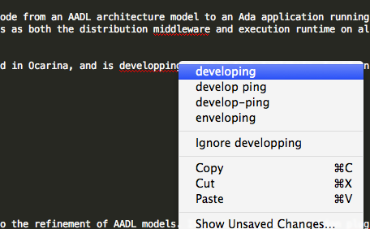

## Spell-Check in Sublime Text



You can enable spell-check in user settings by editing the respective file `Preferences > Settings - User`:
```js
{
    "spell_check": false
}
```

You should also specify a dictionary in your user settings, US English is enabled by default:
```js
    // Word list to use for spell checking
    "dictionary": "Packages/Language - English/en_US.dic",
```
You can download other dictionaries on GitHub - [Sublime Text \ Dictionaries](https://github.com/titoBouzout/Dictionaries)

To change dictionary go to `View > Dictionary` and choose what you need

To active it press `F6` or user Main Menu `View > Spell-Check`

Source: [Jakub Jedryszek`s blog post](http://jj09.net/spell-check-in-sublimetext/)